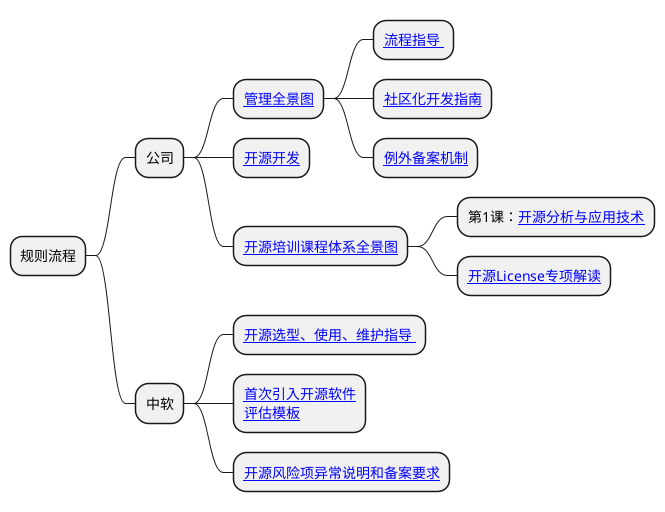

# repo-test

# 1.1 zxcvbnmnbvzxcvcbvnmb这是一条非常长的目录名124321423534564757869结束

## 1.2

#### 3

# 1.1 

## 1.2

#### 3

# 1.1 

## 1.2

#### 3

# 1.1 

## 1.2

#### 3

# 1.1 

## 1.2

#### 3

# 1.1 

## 1.2

#### 3

# 1.1 

## 1.2

#### 3

# 1.1 

## 1.2

#### 3

# 1.1 

## 1.2

#### 3

# 1.1 

## 1.2

#### 3

# 1.1 

## 1.2

#### 3

# 1.1 

## 1.2

#### 3

# 1.1 

## 1.2

#### 3

# 1.1 

## 1.2

#### 3

# 1.1 

## 1.2

#### 4

11
1

dsa
dsa
das
dsa
dsa
d
das
ds
dsa
dsa
dsa
dsa
ds
ad
asd
sad
sad
sad
sa
dsad
1

qwertyuioppoiuytrewq

asdfghjklklkjhgfdsas

zxcvbnmnbvzxcvcbvnmb

${state_sys.theme}${auiThemellersion.slice(3, 4)}.css
可以提取出来

1. 222
2. 2222
3. 3.。。
4. 333

-----

1. ss
1. 22
1. 33
